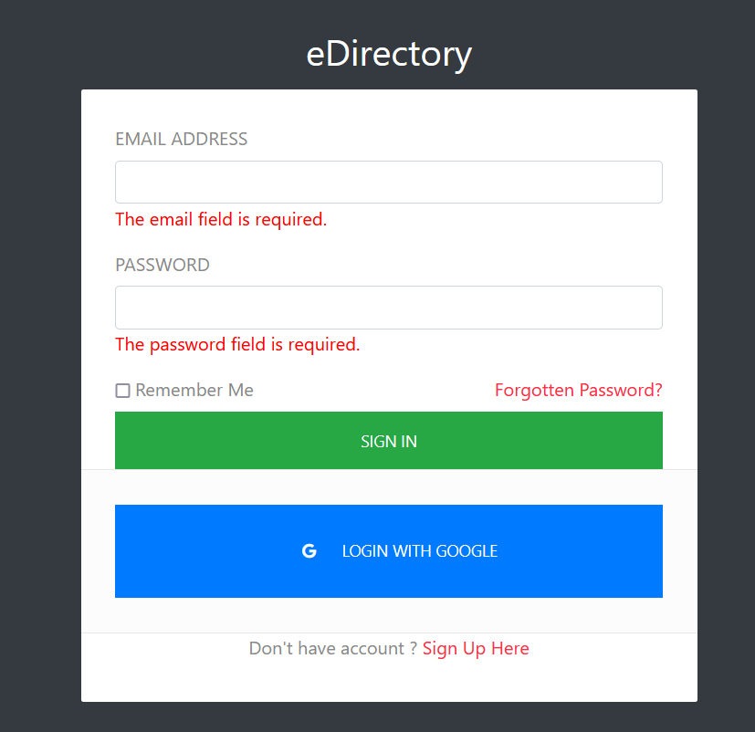
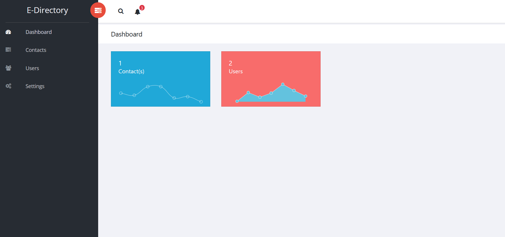

# eDirectory
eDirectory is a simple Contact Management System for managing contacts where users can store, view, edit, and delete contact information. This system can include features like adding contacts and search functionality.
## Deployment
- Clone the repo or download as a zip
- Extract downloaded files intoa folder then copy them to your web server
- Create database and copy .env-copy and rename to .env and edit DB settings accordinly
- Run php artisan migrate to setup table
- Access your application using web browser
  

## License
eDirectory is open-source software licensed under the MIT license.
